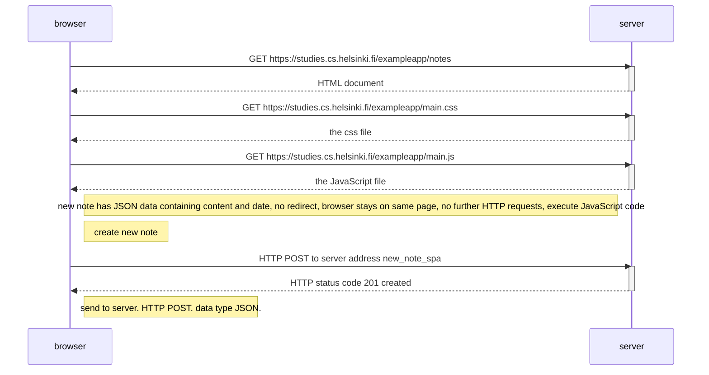

Single-page application (SPA) style

```mermaid
sequenceDiagram
        participant browser
        participant server

        browser->>server: GET https://studies.cs.helsinki.fi/exampleapp/notes
        activate server
        server-->>browser: HTML document
        deactivate server

        browser->>server: GET https://studies.cs.helsinki.fi/exampleapp/main.css
        activate server
        server-->>browser: the css file
        deactivate server

        browser->>server: GET https://studies.cs.helsinki.fi/exampleapp/main.js
        activate server
        server-->>browser: the JavaScript file
        deactivate server

        Note right of browser: new note has JSON data containing content and date, no redirect, browser stays on same page, no further HTTP requests, execute JavaScript code

        Note right of browser: create new note 

        browser->>server: HTTP POST to server address new_note_spa
        activate server
        server-->>browser: HTTP status code 201 created  
        deactivate server
 
        Note right of browser: send to server. HTTP POST. data type JSON. 

```